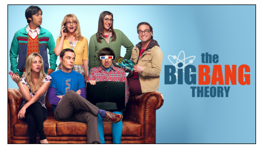
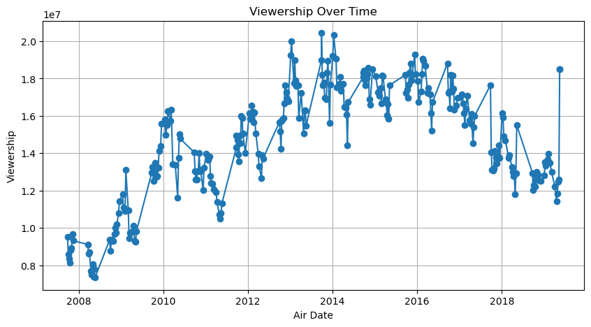
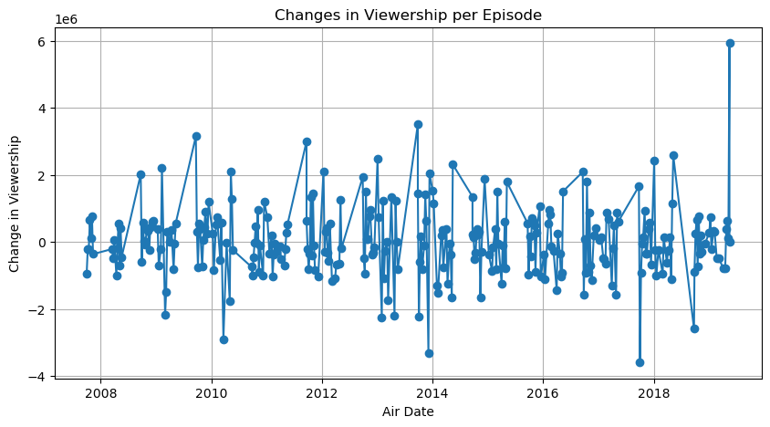

### Amabel Nabila
### 455854


```python
# libraries
import matplotlib.pyplot as plt
import matplotlib.image as mpimg
import pandas as pd
import matplotlib.pyplot as plt
```


```python
# The photo of the TV show
img = mpimg.imread('C:/Users/Febian/Desktop/Tugas UW/RR/RR_hw8/The_Big_Bang_Theory_(Official_Title_Card).jpg')
imgplot = plt.imshow(img)

# Hide the axis numbers
plt.xticks([])
plt.yticks([])

# Show the photo
plt.show() #source: https://www.google.com/url?sa=i&url=https%3A%2F%2Fwww.primevideo.com%2F-%2Fpl%2Fdetail%2FThe-Big-Bang-Theory%2F0SB1KS60V3QYDV79RIBVHV8C2T&psig=AOvVaw39tubiINq9eJrmNCngF0H6&ust=1713557201936000&source=images&cd=vfe&opi=89978449&ved=0CBIQjRxqFwoTCMCrnZTIzIUDFQAAAAAdAAAAABAE
```


    

    


## Introduction

The Big Bang Theory is an American television comedy developed by **Chuck Lorre** and **Bill Prady**, who also acted as executive producers and head writers for the show, with Steven Molaro. It ran on CBS from September 24, 2007 to May 16, 2019, spanning 12 seasons and 279 episodes. (source: https://en.wikipedia.org/wiki/The_Big_Bang_Theory)


## Data


```python
# Load the dataset
data = pd.read_csv('C:/Users/Febian/Desktop/Tugas UW/RR/RR_hw8/big_bang_theory_episodes.csv')
# source: https://www.kaggle.com/code/bcruise/big-bang-theory-episodes-data-analysis/input?select=big_bang_theory_episodes.csv

# Drop NA (if existed)
data.dropna()

# Data view
data
```


<div>
<style scoped>

    .dataframe tbody tr th:only-of-type {
        vertical-align: middle;
    }

    .dataframe tbody tr th {
        vertical-align: top;
    }

    .dataframe thead th {
        text-align: right;
    }
</style>
<table border="1" class="dataframe">
  <thead>
    <tr style="text-align: right;">
      <th></th>
      <th>season</th>
      <th>episode_num_in_season</th>
      <th>episode_num_overall</th>
      <th>title</th>
      <th>directed_by</th>
      <th>written_by</th>
      <th>original_air_date</th>
      <th>prod_code</th>
      <th>us_viewers</th>
    </tr>
  </thead>
  <tbody>
    <tr>
      <th>0</th>
      <td>1</td>
      <td>1</td>
      <td>1</td>
      <td>Pilot</td>
      <td>James Burrows</td>
      <td>Chuck Lorre &amp; Bill Prady</td>
      <td>2007-09-24</td>
      <td>276023</td>
      <td>9520000.0</td>
    </tr>
    <tr>
      <th>1</th>
      <td>1</td>
      <td>2</td>
      <td>2</td>
      <td>The Big Bran Hypothesis</td>
      <td>Mark Cendrowski</td>
      <td>Story by: Chuck Lorre &amp; Bill PradyTeleplay by:...</td>
      <td>2007-10-01</td>
      <td>3T6601</td>
      <td>8580000.0</td>
    </tr>
    <tr>
      <th>2</th>
      <td>1</td>
      <td>3</td>
      <td>3</td>
      <td>The Fuzzy Boots Corollary</td>
      <td>Mark Cendrowski</td>
      <td>Story by: Chuck LorreTeleplay by: Bill Prady &amp;...</td>
      <td>2007-10-08</td>
      <td>3T6602</td>
      <td>8360000.0</td>
    </tr>
    <tr>
      <th>3</th>
      <td>1</td>
      <td>4</td>
      <td>4</td>
      <td>The Luminous Fish Effect</td>
      <td>Mark Cendrowski</td>
      <td>Story by: Chuck Lorre &amp; Bill PradyTeleplay by:...</td>
      <td>2007-10-15</td>
      <td>3T6603</td>
      <td>8150000.0</td>
    </tr>
    <tr>
      <th>4</th>
      <td>1</td>
      <td>5</td>
      <td>5</td>
      <td>The Hamburger Postulate</td>
      <td>Andrew D. Weyman</td>
      <td>Story by: Jennifer GlickmanTeleplay by: Dave G...</td>
      <td>2007-10-22</td>
      <td>3T6604</td>
      <td>8810000.0</td>
    </tr>
    <tr>
      <th>...</th>
      <td>...</td>
      <td>...</td>
      <td>...</td>
      <td>...</td>
      <td>...</td>
      <td>...</td>
      <td>...</td>
      <td>...</td>
      <td>...</td>
    </tr>
    <tr>
      <th>274</th>
      <td>12</td>
      <td>20</td>
      <td>275</td>
      <td>The Decision Reverberation</td>
      <td>Mark Cendrowski</td>
      <td>Story by: Steven Molaro &amp; Steve Holland &amp; Tara...</td>
      <td>2019-04-25</td>
      <td>T12.16020</td>
      <td>11840000.0</td>
    </tr>
    <tr>
      <th>275</th>
      <td>12</td>
      <td>21</td>
      <td>276</td>
      <td>The Plagiarism Schism</td>
      <td>Nikki Lorre</td>
      <td>Story by: Eric Kaplan &amp; Maria Ferrari &amp; Adam F...</td>
      <td>2019-05-02</td>
      <td>T12.16021</td>
      <td>12480000.0</td>
    </tr>
    <tr>
      <th>276</th>
      <td>12</td>
      <td>22</td>
      <td>277</td>
      <td>The Maternal Conclusion</td>
      <td>Kristy Cecil</td>
      <td>Story by: Steve Holland &amp; Eric Kaplan &amp; Jeremy...</td>
      <td>2019-05-09</td>
      <td>T12.16022</td>
      <td>12590000.0</td>
    </tr>
    <tr>
      <th>277</th>
      <td>12</td>
      <td>23</td>
      <td>278</td>
      <td>The Change Constant</td>
      <td>Mark Cendrowski</td>
      <td>Chuck Lorre &amp; Steve Holland &amp; Steven Molaro &amp; ...</td>
      <td>2019-05-16</td>
      <td>T12.16023</td>
      <td>18520000.0</td>
    </tr>
    <tr>
      <th>278</th>
      <td>12</td>
      <td>24</td>
      <td>279</td>
      <td>The Stockholm Syndrome</td>
      <td>Mark Cendrowski</td>
      <td>Chuck Lorre &amp; Steve Holland &amp; Steven Molaro &amp; ...</td>
      <td>2019-05-16</td>
      <td>T12.16024</td>
      <td>18520000.0</td>
    </tr>
  </tbody>
</table>
<p>279 rows × 9 columns</p>
</div>


```python
# Calculate basic statistics for the 'viewership' column
basic_stats = data['us_viewers'].describe()
print("Basic Statistics:")
print(basic_stats)

# Calculate and print median and mode
median_viewership = data['us_viewers'].median()
mode_viewership = data['us_viewers'].mode()[0]
print("Median Viewership:", median_viewership)
print("Mode Viewership:", mode_viewership)
```

    Basic Statistics:
    count    2.790000e+02
    mean     1.464631e+07
    std      3.014511e+06
    min      7.340000e+06
    25%      1.279500e+07
    50%      1.504000e+07
    75%      1.715500e+07
    max      2.044000e+07
    Name: us_viewers, dtype: float64
    Median Viewership: 15040000.0
    Mode Viewership: 15510000.0
    

This means that there are 279 data points, which most likely corresponds to the number of episodes for which audience data is available. Each episode received an average of 14.65 million viewers. The show is fairly popular and consistent. Following this, there is a standard deviation of about 3.01 million viewers, meaning that the viewing statistics for different episodes differed by this much from the average. 

This degree of variance is rather mild, indicating that while some episodes were more popular than others, viewership did not shift much. The least-watched episode garnered 7.34 million viewers, indicating the series' basic popularity. 25% of the episodes had viewing numbers less than 12.80 million, suggesting a lower quartile of audience distribution. 

The viewership for half of the programs exceeded 15.04 million, while the other half fell short of that figure. The median is somewhat above the mean, indicating a slightly right-skewed distribution. 75% of the episodes had viewing figures less than 17.16 million, which is in the top quartile, indicating that the most-watched episodes received much higher ratings. 

The most-watched episode attracted 20.44 million viewers, indicating the series' peak popularity. Meanwhile, the most common viewing figure observed was roughly 15.51 million people. This might indicate that numerous episodes were on the verge of reaching a certain level of viewership.

## A Graph of the Viewership Over Time


```python
# Convert 'original_air_date' to datetime if necessary
data['original_air_date'] = pd.to_datetime(data['original_air_date'])

# Plotting the viewership over time
plt.figure(figsize=(10, 5))
plt.plot(data['original_air_date'], data['us_viewers'], marker='o')
plt.title('Viewership Over Time')
plt.xlabel('Air Date')
plt.ylabel('Viewership')
plt.grid(True)
plt.show()
```


    

    


The "1e7" on the y-axis is scientific notation of 1 x 10<sup>7</sup> for 10 million. This suggests that viewership on the y-axis is in the tens of millions. For example, a viewership figure of 1.5 on the graph represents 15 million viewers. This notation makes it simpler to read and analyze huge numbers on a graph.

Moreover, an general increase in viewing from the beginning until approximately the middle of the series, indicating that the show was growing popularity. After peaking, viewership varies from episode to episode but remains strong overall, showing persistent interest in the show. There are several noteworthy drops, which might be attributed to season finales or debuts, or to special events that impacted audience ratings. Viewership appears to diminish at the conclusion of the series, which is not unusual for long-running shows.

## A Graph of the Episode-to-Episode (or Season-to-Season) Changes in Viewership


```python
# Calculate changes in viewership between episodes
data['viewership_change'] = data['us_viewers'].diff()

# Plotting the changes in viewership
plt.figure(figsize=(10, 5))
plt.plot(data['original_air_date'], data['viewership_change'], marker='o')
plt.title('Changes in Viewership per Episode')
plt.xlabel('Air Date')
plt.ylabel('Change in Viewership')
plt.grid(True)
plt.show()
```


    

    


The y-axis is labeled '1e6', which represents 1 x 10<sup>6</sup> or one million. Thus, a value of '2' on the y-axis represents a shift of 2 million viewers between episodes.

The figure demonstrates large changes in viewership between episodes. This is common for TV programs, as viewership might fluctuate owing to a variety of variables such as competition from other shows, time of year, and narrative developments. There is a notably strong jump at the end of the series, indicating a huge increase in viewing between episodes. This might be due to a high-profile storyline event, such as a season premiere, finale, or special episode. There are also occasions where the viewership change falls below zero, suggesting a decrease from the prior show. This is also expected, particularly in lengthier programs when certain episodes may not be as interesting. 


```python
# Calculate specific change (between seasons 3 and 5)
season_3_avg = data[data['season'] == 3]['us_viewers'].mean()
season_5_avg = data[data['season'] == 5]['us_viewers'].mean()
change_in_viewership = season_5_avg - season_3_avg

print(f"The viewership decreased by {change_in_viewership:.2f} between seasons 3 and 5.")
```

    The viewership decreased by 762554.35 between seasons 3 and 5.
    

Between seasons 3 and 5 of "The Big Bang Theory," average viewership decreased by around 762,554 people, according to the calculations. This shows that the show's popularity or viewer engagement decreased somewhat throughout this time period.

